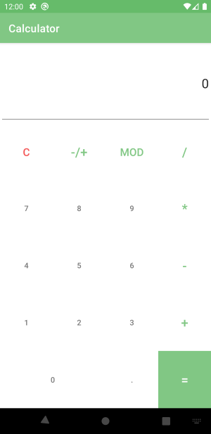
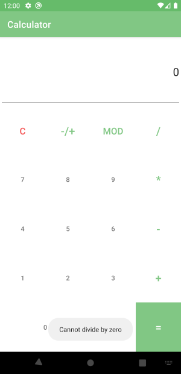

Calculator
===========

The program contain a number pad, one text field
to preview operand values and show results, and buttons for basic mathematical
operations (`+`, `-`, `*`, `/`, `MOD`, `+/-`). The app imitate a simple
electronic calculator using the `BigDecimal` class to store numbers and perform
operations on them.

UI Widgets:

* `EditText`
* `Button`
* `TableLayout`

`Toast` popups shows with user-friendly
error messages for attempts to divide by zero.

Result:

